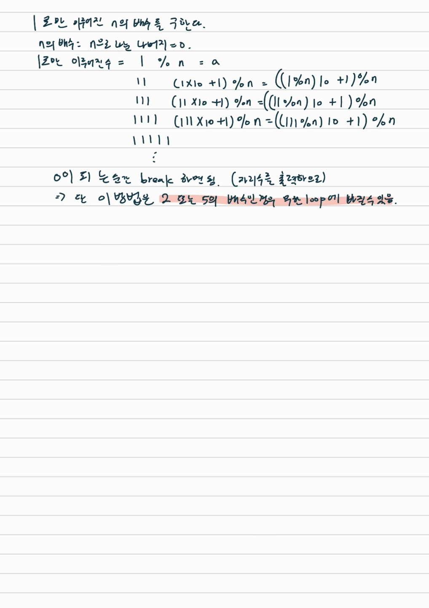

# 1
- 문제링크 (https://www.acmicpc.net/problem/4375)
- 풀이자: 홍주영
- 풀이일자: 2022-11-15(화)

## 알고리즘
나머지연산

## 시간복잡도
O(N): 0 < 나머지 < N이므로, 최악의 경우 N번 반복
- 참조: 백준 강의
- 실제 소요 시간
    - 80 ms
- 실제 소요 메모리
    - 30840 KB

## 해설


## 중요 포인트
- X가 N의 배수: X % N == 0
- 1로만 이루어진 수는 그 전 단계의 수 * 10 + 1로 다시 만들 수 있다.
- 1 % N = 1

## 코드
``` python
while True: # 계속 들어오는 테스트 케이스 입력을 받기 위한 반복문
    try: # 계속 들어오는 테스트 케이스 입력을 받기 위한 예외처리
        N = int(input())
    except:
        break
    # 여기부터 본 코드
    remains = 1 % N # N으로 나눈 나머지
    digits = 1 # 자리수
    while remains: # 나머지가 0이 아닌동안 반복
        remains = (remains * 10 + 1) % N # (이전의 나머지 * 10 + 1)을 다시 N으로 나눈 나머지
        digits += 1 # 자리수 증가
    print(digits)
```