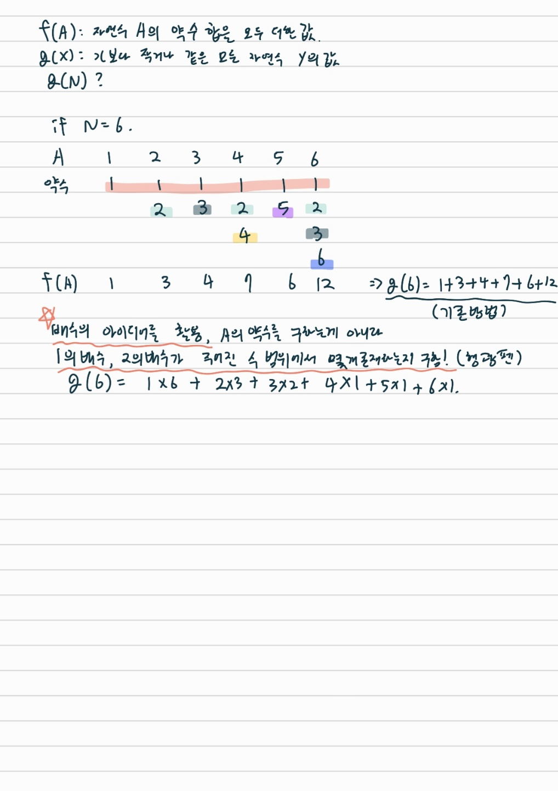

# 약수의 합 2
- 문제링크 (https://www.acmicpc.net/problem/17427)
- 풀이자: 홍주영
- 풀이일자: 2022-11-19(토)

## 알고리즘
약수의 특성

## 시간복잡도
O(N)
배수의 합을 구하기 위해 자연수를 순회하며 N번 반복한다.

- 참조: 백준 강의
- 실제 소요 시간
    - 244 ms
- 실제 소요 메모리
    - 30840 KB

## 해설



## 중요 포인트
- 배수

주어진 수의 약수를 자연수 순서대로 차례차례 구하지 말고, 배수의 아이디어를 활용해서 수의 범위안에 1의배수가 몇개인지, 2의배수가 몇개인지.. 등을 구해서 더한다.

ex) g(6)

g(6) = 1 + 3 + 4 + 7 + 6 + 12 = 1x6 + 2x3 + 3x2 + 4x1 + 5x1 + 6x1

## 코드
``` python
N = int(input())
g_N = N # 모든 자연수는 1을 약수로 가짐
for natural_number in range(2, N+1): # 2부터 N까지 구함
    g_N = g_N + natural_number * (N // natural_number) # 자연수 * N이하에서 포함된 횟수(몫)
print(g_N)
```