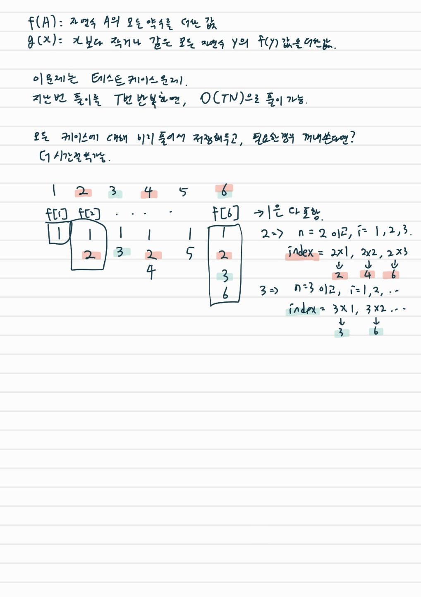

# 약수의 합
- 문제링크 (https://www.acmicpc.net/problem/17425)
- 풀이자: 홍주영
- 풀이일자: 2022-11-19(토)

## 알고리즘
- 브루트 포스

## 시간복잡도
O(NlogN + T)
모든 테스트 케이스에서 미리 N 이하의 값들을 구해둔다.

- 참조: 백준 강의
- 실제 소요 시간
    - 시간초과
- 실제 소요 메모리
    - 시간초과

## 해설



## 중요 포인트
- 테스트케이스

같은 수를 여러번 계산하는 것을 피하기 위해, 모든 조건하에서 문제를 해결해두고 필요한 답을 꺼내 쓴다.

## 코드
``` python
f = [1] * (1000000+2) # 모든수는 1을 약수로 가지므로 미리 넣어둠
f[0] = 0 # index가 0부터 시작하므로 조정
for n in range(2, 1000000+1): # 자연수 N의 범위만큼 반복
    i = 1
    while n*i < 1000001: # 주어진 범위 안에 속하면
        f[n*i] += n # n의 배수들에 n을 더함
        i += 1
# f 미리 계산해서 저장해두기 끝 (O(NlogN))
g = [0] * (1000000+2) # 미리 만들어둠
g[1] = 1
for i in range(2, 1000000+1):
    g[i] = g[i-1] + f[i]
# g 계산 끝 (O(N))
T = int(input())
for t in range(T):
    N = int(input())
    print(g[N])
```